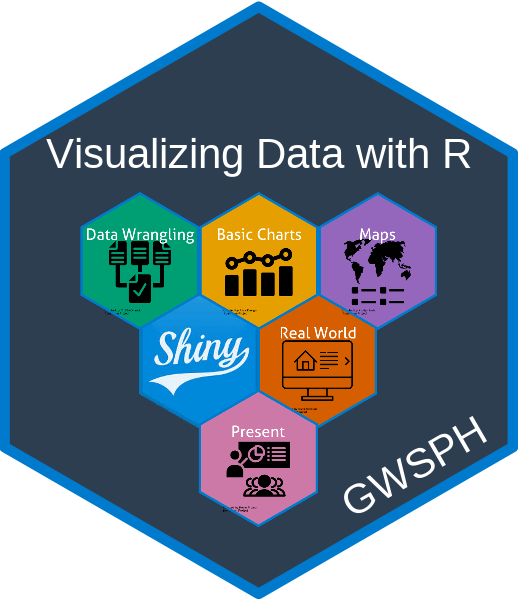

---
output:
  github_document:
    html_preview: false
---

<!-- README.md is generated from README.Rmd. Please edit that file -->

## PUBH 6199: Visualizing Data with R (Summer 2025) <a href='https://pubh6199-data-viz-with-r.github.io/2025-Summer'></a>

<!-- badges: start -->
[](https://creativecommons.org/licenses/by-sa/4.0/)
<!-- badges: end -->

### Description

```{r child = here::here("fragments", "description.qmd")}
```

For more details, please see the [course
website](https://pubh6199-data-viz-with-r.github.io/2025-Summer).

### Acknowledgments

This course was inspired by many other courses / resources that cover
similar material - see the course [about
page](https://pubh6199-data-viz-with-r.github.io/2025-Summer/about.html) for more details.
