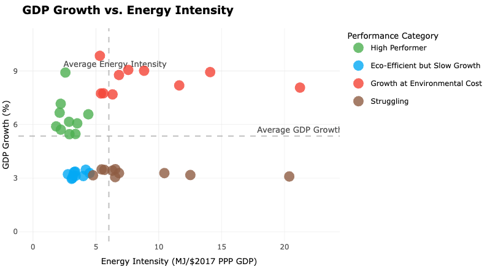
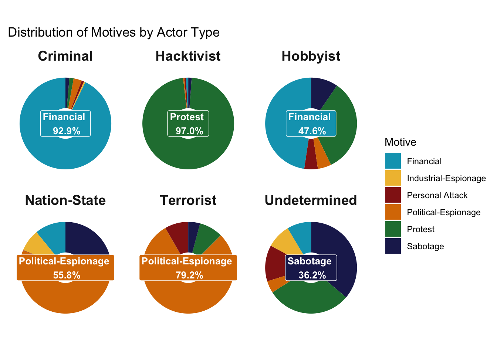
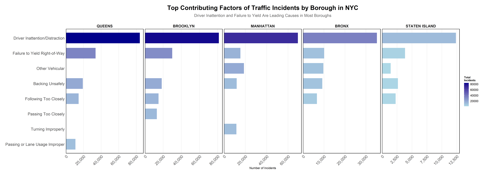
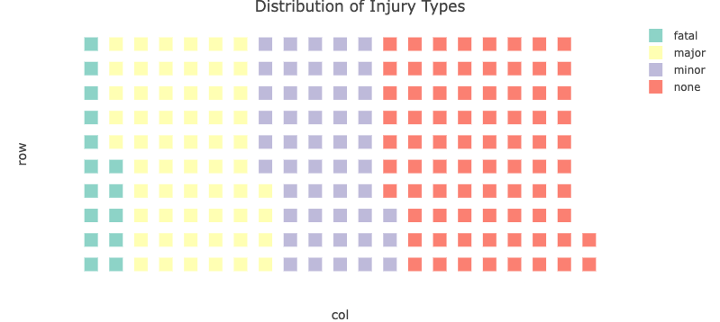

```{r setup, child="../setup.Rmd"}
```

---

class: center, middle

# [Air Sciencia: Evaluating Airline Performance](https://youtu.be/XbTvNAiVCGc)

## by Sasha Green, Arman Naseh, Jake Anszelowicz, and Amine Louri

---

class: center, middle

# [Evolving Trends in Cyber Events:<br>Insights from a Decade of Data](https://www.canva.com/design/DAGYPOA5cNQ/5mCLl8Ph1XLqyW3ZObjqMw/view?utm_content=DAGYPOA5cNQ&amp;utm_campaign=designshare&amp;utm_medium=link2&amp;utm_source=uniquelinks&amp;utlId=h553d00ae54)

## by Annie Goodman and Etiene Effiong

---

class: center, middle

# Changes in the European Energy Market due the Russia-Ukraine War

## by Gavin Ulrich and Byeonghun Kwon

---

class: center, middle

# Assessing EV accessibility and affordability in the United States

## by Daniel Fisher and Zain Hoda

---

class: center, middle

# Global Energy Analysis: How do countries achieve economic growth while maintaining low energy intensity?

## by Angel Ho and Easha Rajalaxmi Vivesh

---

class: center, middle

# Understanding Movie Performance Through Data: Financial Trends, Ratings, and Profitability from TMDB and Rotten Tomatoes

## by Ibrahim Ahmed and Paul Asamoah Boadu

---

class: center, middle

# Cracking The NCAA Team Rankings Code: The Attributes of the Best NCAA Football Playoff Teams Over a Decade

## by Kyla Rounsoville, Maddie Wilson, and Alana Lee

---

class: center, middle

# Understanding Traffic Crashes in New York City

## by Ali Irtaza and Tarun Kumanduri

---

class: center, middle

# [Analyzing Olympic Success: Analyzing the Correlation Between Medal Count and Socioeconomic Factors](https://docs.google.com/presentation/d/16FkGQOGbbsJWybBEhIBIxmaLkjNrXmvraF9JIaTTyXM/edit#slide=id.g2d6a80122c9_0_354)

## by Hannah Hodge, Sandy Alksninis, Jedidiah Bechtel, and Aedan Bayhan

---

class: center, middle

# [Shark Incidents in California](https://vimeo.com/1038058323?share=copy#t=0)

## by Luis Bracho, Diego Farah, and Diego Paredes

---

class: center, middle

# [Car Bloat in the United States: Do Americans have an obsession with big vehicles?](https://vimeo.com/1038262009)

## by Ifeoluwa Olaniyan and Emmanuel Agbeko

---

class: center, middle, inverse 

# 🎉 Awards Ceremony 🎉

---

class: center, middle, inverse

# ✨ The Nominees for the **Shiny** Award 

---

class: center, middle 

# **Shiny Nominee**: Global Energy Analysis

<center>

</center>

---

class: center, middle 

# **Shiny Nominee**: Cyber Events

<center>

</center>

---

class: center, middle 

# **Shiny Nominee**: NYC Trafic Crashes

<center>

</center>

---

class: center, middle 

# **Shiny Nominee**: Shark Attacks

<center>

</center>

---

class: center, middle, inverse

# ✨ The **Shiny** Award goes to...🥁

---

class: center, middle, inverse

# 🎉🎉🎉

.leftcol[

## [Evolving Trends in Cyber Events: Insights from a Decade of Data](https://eda.seas.gwu.edu/showcase/2024-Fall/cyber-events.html)

#### by Annie Goodman and Etiene Effiong

]

.rightcol[

<center>

</center>

]

---

# 🗑️ The Nominees for the **Janitor** award are:

--

.cols3[

### Car Bloat in the United States: Do Americans have an obsession with big vehicles?

#### by Ifeoluwa Olaniyan and Emmanuel Agbeko

]

--

.cols3[

### Cracking The NCAA Team Rankings Code: The Attributes of the Best NCAA Football Playoff Teams Over a Decade

#### by Kyla Rounsoville, Maddie Wilson, and Alana Lee

]

--

.cols3[

### Assessing EV accessibility and affordability in the United States

#### by Daniel Fisher and Zain Hoda

]

---

class: center, middle, inverse

# 🗑️ The **Janitor** award goes to...🥁

---

class: center, middle, inverse

# 🎉🎉🎉

## Cracking The NCAA Team Rankings Code: The Attributes of the Best NCAA Football Playoff Teams Over a Decade

### by Kyla Rounsoville, Maddie Wilson, and Alana Lee

---

class: center, middle, inverse

## Fill out course evals: https://gwu.smartevals.com/

### (please be specific!)

<center>

</center>
