```{r setup, child="../setup.Rmd"}
```

```{r, include=FALSE}
library(HistData)

# Read in data sets for class
milk_production <- read_csv(here::here('data', 'milk_production.csv'))
lotr_words <- read_csv(here::here('data', 'lotr_words.csv'))
marathon <- read_csv(here::here('data', 'marathon.csv'))
tb_cases <- read_csv(here::here('data', 'tb_cases.csv'))
wildlife_impacts <- read_csv(here::here('data', 'wildlife_impacts.csv'))
daysToShip <- data.frame(
    order = seq(12),
    warehouseA = c(3,3,3,4,4,4,5,5,5,5,5,5),
    warehouseB = c(1,1,1,3,3,4,5,5,5,6,7,10)
)
```

---

class: center, middle, inverse

# Quiz solution

---

class: center, middle, inverse

# Tip of the week:

# `theme_set()`

---

```{r, eval=FALSE}
ggplot(mtcars) +
  geom_point(aes(x = mpg, y = hp))
```

.leftcol[

Default theme

```{r, echo=FALSE}
ggplot(mtcars) +
  geom_point(aes(x = mpg, y = hp)) +
  theme_gray()
```

]

.rightcol[

`theme_bw(base_size = 20)`

```{r, echo=FALSE}
ggplot(mtcars) +
  geom_point(aes(x = mpg, y = hp)) +
  theme_bw(base_size = 20)
```

]

---

```{r child="topics/0.Rmd"}
```

---

```{r child="topics/1.Rmd"}
```

---

.leftcol[

# Exploratory Analysis

<br>

### Goal: **Form** hypotheses.
### Improves quality of **questions**.
### _(what we do in THIS class)_

]

--

.rightcol[

# Confirmatory Analysis

<br>

### Goal: **Test** hypotheses.
### Improves quality of **answers**.
### _(what you do in a stats class)_

]

---

.leftcol[

# Exploratory Analysis

<br>

RQ: Do people bike more when the weather is nice?

<center>
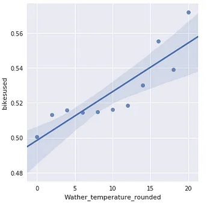
</center>

]

--

.rightcol[

# Confirmatory Analysis

<br>

Let's build a model to predict bike usage based on weather.

]

---

class: center, inverse

# Don't be Icarus

<center>

</center>

---

class: inverse, middle

## "An _approximate_ answer to the _right_ question is better<br>than an _exact_ answer to the _wrong_ question."
## — [John Tukey](https://en.wikipedia.org/wiki/John_Tukey)

---

class: center
background-color: #FFFFFF

**EDA is an iterative process to help you<br>_understand_ your data and ask better questions**

<center>
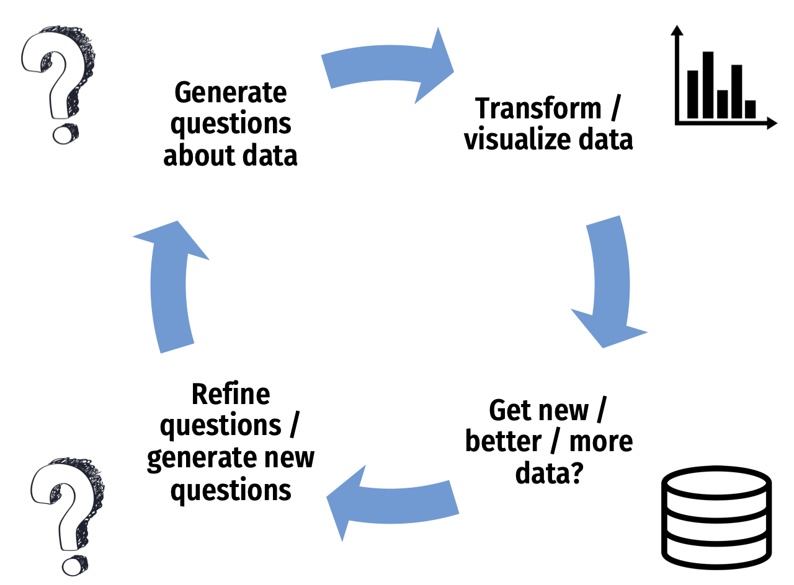
</center>

---

```{r child="topics/2.Rmd"}
```

---

class: inverse, center, middle

# 24,901

???

If I walked up to you, and said, "The answer is 24,901,"
you would probably be confused.
By itself, a number means nothing.

---

class: inverse, center, middle

# .orange[Earth's circumference at the equator:]<br>24,901

???

But if I were to tell you that the circumference of the earth at the equator is 24,901 miles, that would mean something.

---

class: inverse, center, middle

# Earth's circumference at the equator:<br>24,901 .orange[miles]

???

To be complete and meaningful, quantitative information consists of both quantitative data (the numbers) and categorical data (the labels that tell us what the numbers measure).

---

# Types of Data

--

.leftcol[

### **Categorical**

Subdivide things into _groups_

- What type?
- Which category?

]

--

.rightcol[

### **Numerical**

Measure things with numbers

- How many?
- How much?

]

---

## Categorical (discrete) variables

--

.leftcol[

### **Nominal**

- Order doesn't matter
- Differ in "name" (nominal) only

e.g. `country` in TB case data:

.code80[

```{r, echo=FALSE}
tb_cases
```

]]

--

.rightcol[

### **Ordinal**

- Order matters
- Distance between units not equal

e.g.: `Placement` 2017 Boston marathon:

.code80[

```{r, echo=FALSE}
marathon %>%
  dplyr::select(Placement = Overall, `Official Time`, Name) %>%
  head()
```

]]

---

## Numerical data

--

.leftcol[

### **Interval**

- Numerical scale with<br>arbitrary starting point
- No "0" point
- Can't say "x" is double "y"

e.g.: `temp` in Beaver data

```{r, echo=FALSE}
beaver1 %>%
    arrange(day) %>%
    head()
```

]

--

.rightcol[

### **Ratio**

- Has a "0" point
- Can be described as percentages
- Can say "x" is double "y"

e.g.: `height` & `speed` in wildlife impacts

```{r, echo=FALSE}
wildlife_impacts %>%
    filter(!is.na(height), ! is.na(speed)) %>%
    dplyr::select(incident_date, height, speed) %>%
    head()
```

]

---

class: inverse, center, middle

# Key Questions

--

.leftcol[

## Categorical

## .orange[Does the order matter?]

Yes: **Ordinal**

No: **Nominal**

]

--

.rightcol[

## Numerical

## .orange[Is there a "baseline"?]

Yes: **Ratio** 

No: **Interval**

]

---

class: center, middle

# Be careful of how variables are encoded!

---

## .red[When numbers are categories]

- "Dummy coding": e.g., `passedTest` = `1` or `0`)
- "North", "South", "East", "West" = `1`, `2`, `3`, `4`

--

## .red[When ratio data are discrete (i.e. counts)]

- Number of eggs in a carton, heart beats per minute, etc.
- Continuous variables measured discretely (e.g. age)

--

## .red[Time]

- As _ordinal_ categories: "Jan.", "Feb.", "Mar.", etc.
- As _interval_ scale: "Jan. 1", "Jan. 2", "Jan. 3", etc.
- As _ratio_ scale: "30 sec", "60 sec", "70 sec", etc.

---

```{r child="topics/3.Rmd"}
```

---

class: inverse, middle

# .center[.font140[Summary Measures:]]

# Single variables: .red[Centrality] &  .blue[Variability]

# Two variables: .green[Correlation]

---

# .center[.red[Centrality (a.k.a. The "Average" Value)]]

--

### .center[A single number representing the _middle_ of a set of numbers]

<br>

--

### **Mean**: $\frac{\text{Sum of values}}{\text{# of values}}$

--

### **Median**: "Middle" value (50% of data above & below)

---

# .center[Mean isn't always the "best" choice]

.leftcol40[

```{r}
wildlife_impacts %>%
    filter(! is.na(height)) %>%
    summarise(
      mean = mean(height),
      median = median(height)
    )
```

Percent of data below mean:

```{r, echo=FALSE}
percentiles <- ecdf(wildlife_impacts$height)
meanP <- percentiles(mean(wildlife_impacts$height, na.rm = TRUE))
paste0(round(100*meanP, 1), '%')
```

]

--

.rightcol60[

.center[**On average, at what height do planes hit birds?**]

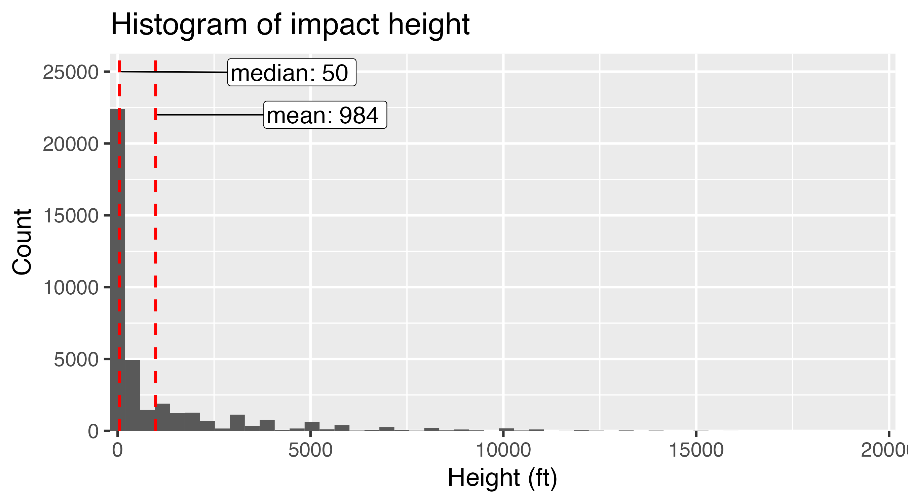

]

???

On average, where do planes hit birds?
Saying ~1000 ft is misleading
It's much more likely to be under 100 ft

---

class: inverse

# .center[Beware the "flaw of averages"]

--

.leftcol[

### What happened to the statistician that crossed a river with an average depth of 3 feet?

]

--

.rightcol[

### ...he drowned

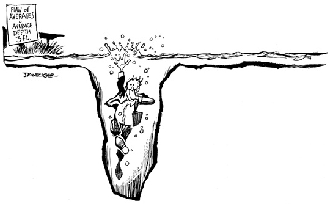

]

---

# .center[.blue[Variability ("Spread")]]

--

### **Standard deviation**: distribution of values relative to the mean
### $s = \sqrt{\frac{\sum_{i=1}^{N}(x_i - \bar{x})^2}{N - 1}}$

--

### **Interquartile range (IQR)**: $Q_3 - Q_1$ (middle 50% of data)

--

### **Range**: max - min

---

# .center[.fancy[Example:] Days to ship]

.leftcol40[

Complaints are coming in about orders shipped from warehouse B, so you collect some data:

.code70[

```{r}
daysToShip
```

]]

--

.rightcol60[

Here, **averages** are misleading:

```{r}
daysToShip %>%
    gather(warehouse, days, warehouseA:warehouseB) %>%
    group_by(warehouse) %>%
    summarise(
        mean   = mean(days), #<<
        median = median(days)) #<<
```

]

---

# .center[.fancy[Example:] Days to ship]

.leftcol40[

Complaints are coming in about orders shipped from warehouse B, so you collect some data:

.code70[

```{r}
daysToShip
```

]]

.rightcol60[

**Variability** reveals difference in days to ship:

```{r}
daysToShip %>%
    gather(warehouse, days, warehouseA:warehouseB) %>%
    group_by(warehouse) %>%
    summarise(
        mean   = mean(days),
        median = median(days),
        range = max(days) - min(days), #<<
        sd    = sd(days)) #<<
```

]

---

# .center[.fancy[Example:] Days to ship]

<center>
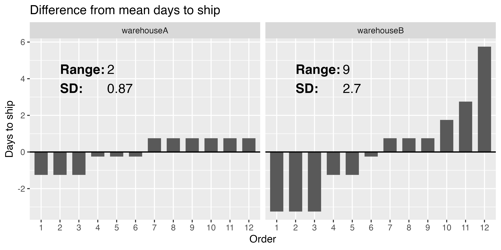
</center>

---

class: center

# Interpreting the standard deviation

.leftcol[

### $s = \sqrt{\frac{\sum_{i=1}^{N}(x_i - \bar{x})^2}{N - 1}}$

<center>
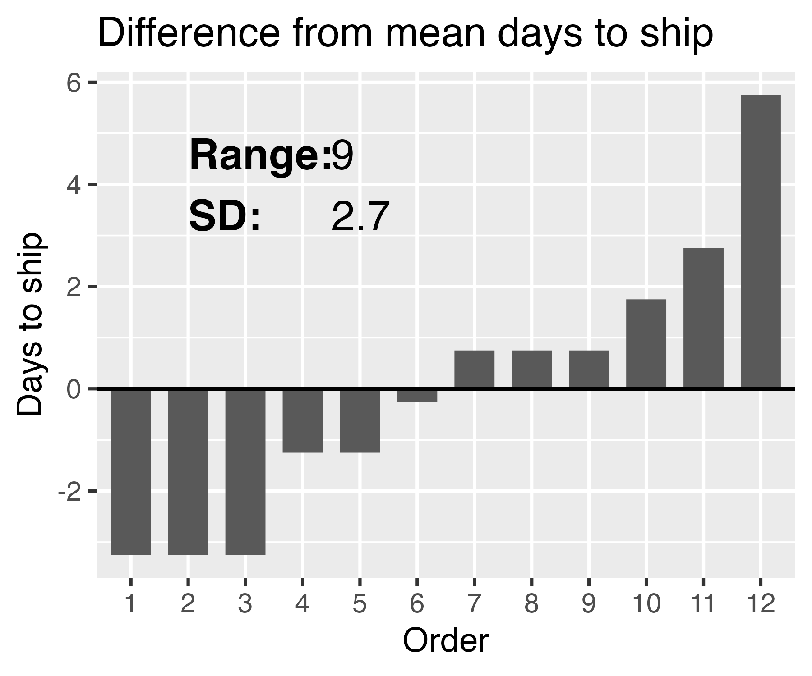
</center>

]

--

.rightcol[


]

---

class: inverse, center

# Outliers

<center>

</center>

---

## **Mean** & **Standard Deviation** are sensitive to outliers

**Outliers**: $Q_1 - 1.5 IQR$ or $Q_3 + 1.5 IQR$

**Extreme values**: $Q_1 - 3 IQR$ or $Q_3 + 3 IQR$

--

.leftcol[

```{r}
data1 <- c(3,3,4,5,5,6,6,7,8,9)
```

- Mean: `r mean(data1)`
- Standard Deviation: `r round(sd(data1), 2)`
- Median: `r median(data1)`
- IQR: `r IQR(data1)`

]

--

.rightcol[

```{r}
data2 <- data1
data2[10] <- 20
```

- .red[Mean: `r mean(data2)`]
- .red[Standard Deviation: `r round(sd(data2), 2)`]
- Median: `r median(data2)`
- IQR: `r IQR(data2)`

]

---

class: inverse, middle

# .center[Robust statistics for continuous data]
# .center[(less sensitive to outliers)]

## .red[Centrality]: Use _median_ rather than _mean_

## .blue[Variability]: Use _IQR_ rather than _standard deviation_

---

class: inverse

```{r, echo=FALSE}
countdown(
    minutes      = 10,
    warn_when    = 15,
    update_every = 1,
    top          = 0,
    right        = 0,
    font_size    = '2em'
)
```

# Practice with summary measurements

### 1) Read in the following data sets:

- `milk_production.csv`
- `lotr_words.csv`

### 2) For each variable in each data set, if possible, summarize its

### 1. .red[Centrality]
### 2. .blue[Variability]

---

```{r child="topics/4.Rmd"}
```

---

class: center

# "Visualizing data helps us think"

<center>

</center>

.left[.footer-small[Stephen Few (2009, pg. 6)]]

---

background-color: #fff
class: center

# Anscombe's Quartet

<center>
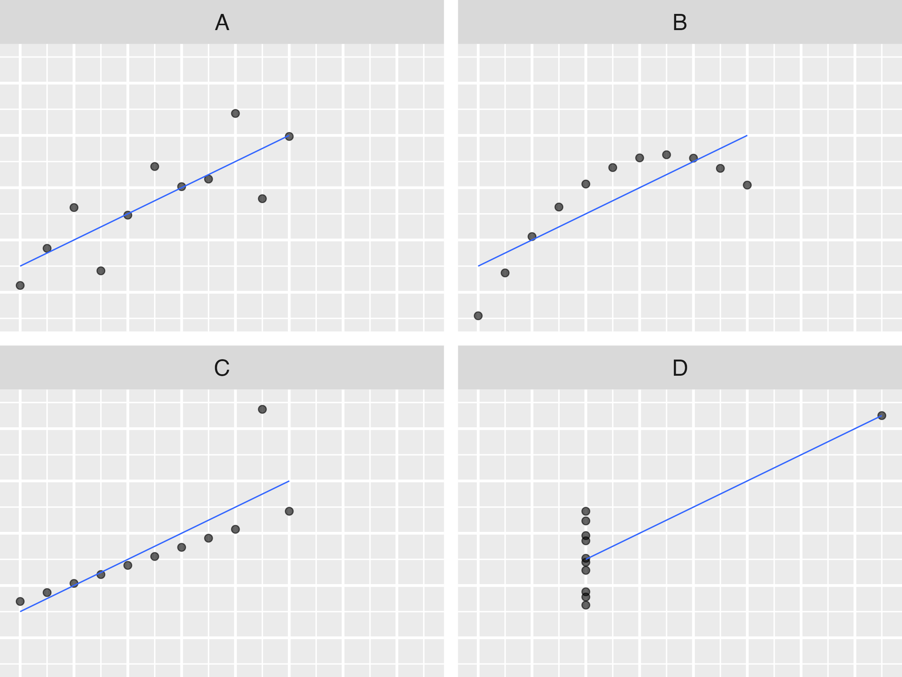
</center>

.left[.footer-small[Stephen Few (2009, pg. 6)]]

---

background-color: #fff
class: center

.leftcol60[

# Anscombe's Quartet

<center>

</center>


]

.rightcol40[

<br>
<center>

</center>

]

---

class: inverse, center, middle

# The data _type_ determines <br> how to summarize it

---

.cols3[

### **Nominal<br>(Categorical)**

**Measures**:
- Frequency counts /<br>Proportions
<br>
<br>
<br>
<br>

**Charts**:
- Bars

]

--

.cols3[

### **Ordinal<br>(Categorical)**

**Measures**:
- Frequency counts /<br>Proportions
- .red[Centrality]:<br>Median, Mode
- .blue[Variability]: IQR
<br>

**Charts**:
- Bars

]

--

.cols3[

### **Numerical<br>(Continuous)**

**Measures**:
- .red[Centrality]:<br>Mean, median
- .blue[Variability]: Range, standard deviation, IQR
<br>
<br>

**Charts**:
- Histogram
- Boxplot

]

---

## Summarizing **Nominal** data

.leftcol45[

Summarize with counts / percentages

```{r}
wildlife_impacts %>%
    count(operator, sort = TRUE) %>% #<<
    mutate(p = n / sum(n)) #<<
```

]

--

.rightcol55[

Visualize with (usually sorted) bars 

.code70[

```{r wildlife-operator-bars, fig.width=7, fig.height=3}
wildlife_impacts %>%
    count(operator, sort = TRUE) %>%
    ggplot() + #<<
    geom_col(aes(x = n, y = reorder(operator, n)), #<<
             width = 0.7) + #<<
    labs(x = "Count", y = "Operator")
```

]]

---

## Summarizing **Ordinal** data

.leftcol[

**Summarize**: Counts / percentages

.code70[
```{r}
wildlife_impacts %>%
    count(incident_month, sort = TRUE) %>% #<<
    mutate(p = n / sum(n)) #<<
```

]]

--

.rightcol[

**Visualize**: Bars

.code70[

```{r wildlife-months-bar, fig.width=7, fig.height=3.7}
wildlife_impacts %>%
    count(incident_month, sort = TRUE) %>%
    ggplot() + #<<
    geom_col(aes(x = as.factor(incident_month), #<<
                 y = n), width = 0.7) + #<<
    labs(x = "Incident month")
```

]]

---

## Summarizing **continuous** variables

.leftcol30[

**Histograms**:

- Skewness
- Number of modes

<br>

**Boxplots**:

- Outliers
- Comparing variables

]

.rightcol70[.border[

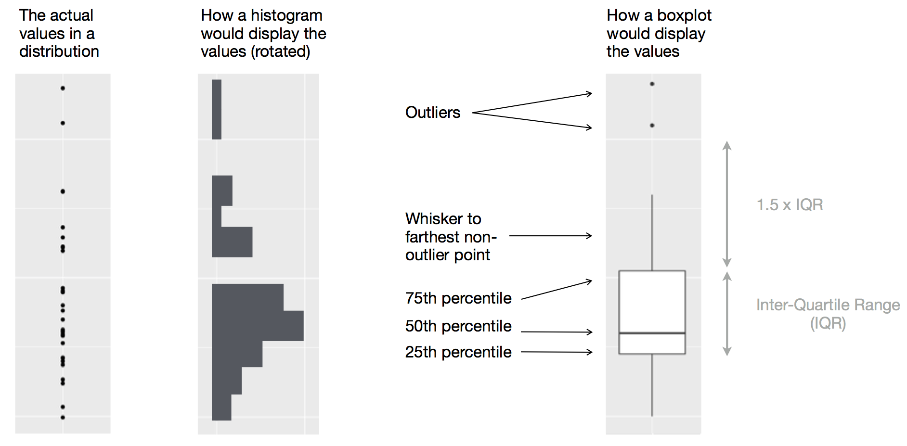

]]

---

## **Histogram**: Identify Skewness & # of Modes

.leftcol40[

**Summarise**:<br>Mean, median, sd, range, & IQR:

```{r}
summary(wildlife_impacts$height)
```

]

--

.rightcol60[

**Visualize**:<br>Histogram (identify skewness & modes)

```{r wildlife-height-hist, fig.width=7, fig.height=3.7, fig.align='center'}
ggplot(wildlife_impacts) +
  geom_histogram(aes(x = height), bins = 50) + #<<
  labs(x = 'Height (ft)', y = 'Count')
```

]

---

## **Histogram**: Identify Skewness & # of Modes

.leftcol[

**Height**

```{r, ref.label="wildlife-height-hist", fig.width=7, fig.height=3.7, fig.align='center'}
```

]

.rightcol[

**Speed**

```{r wildlife-speed-hist, fig.width=7, fig.height=3.7, fig.align='center'}
ggplot(wildlife_impacts) +
  geom_histogram(aes(x = speed), bins = 50) + #<<
  labs(x = 'speed (mph)', y = 'Count')
```

]

---

## **Boxplot**: Identify outliers

.leftcol[

**Height**

```{r wildlife-height-boxplot, fig.width=7, fig.height=3, fig.align='center'}
ggplot(wildlife_impacts) +
    geom_boxplot(aes(x = height)) + #<<
    labs(x = 'Height (ft)', y = NULL)
```
]

.rightcol[

**Speed**

```{r wildlife-speed-boxplot, fig.width=7, fig.height=3, fig.align='center'}
ggplot(wildlife_impacts) +
    geom_boxplot(aes(x = speed)) + #<<
    labs(x = 'Speed (mph)', y = NULL)
```

]

---

.leftcol[

## Histogram

- Skewness
- Modes

```{r, ref.label="wildlife-speed-hist", echo=FALSE, fig.width=7, fig.height=3.7, fig.align='center'}
```

]

.rightcol[

## Boxplot

- Outliers

<br><br>

```{r, ref.label="wildlife-speed-boxplot", echo=FALSE, fig.width=7, fig.height=3, fig.align='center'}
```

]

---

class: inverse

```{r, echo=FALSE}
countdown(
    minutes      = 15,
    warn_when    = 15,
    update_every = 1,
    top          = 0,
    right        = 0,
    font_size    = '2em'
)
```

# Practicing visual summaries

.font90[

1) Read in the following data sets:

- `faithful.csv`
- `marathon.csv`

2) Summarize the following variables using an appropriate chart (bar chart, histogram, and / or boxplot):

- faithful: `eruptions`
- faithful: `waiting`
- marathon: `Age`
- marathon: `State`
- marathon: `Country`
- marathon: `` `Official Time` ``

]

---

class: inverse, center

# Break!

## Stand up, Move around, Stretch!

```{r, echo=FALSE}
countdown(
    minutes = 5,
    warn_when = 30,
    update_every = 1,
    left = 0, right = 0, top = 1, bottom = 0,
    margin = "5%",
    font_size = "8em"
)
```

---

```{r child="topics/5.Rmd"}
```

---

## .center[Some pretty racist origins in [eugenics](https://en.wikipedia.org/wiki/Eugenics) ("well born")]

--

.leftcol[

### [Sir Francis Galton](https://en.wikipedia.org/wiki/Francis_Galton) (1822 - 1911)

- Charles Darwin's cousin.
- "Father" of [eugenics](https://en.wikipedia.org/wiki/Eugenics).
- Interested in heredity.

<center>

</center>

]

--

.rightcol[

### [Karl Pearson](https://en.wikipedia.org/wiki/Karl_Pearson) (1857 - 1936)

- Galton's ([hero-worshiping](https://en.wikipedia.org/wiki/Apotheosis)) protégé.
- Defined correlation equation.
- "Father" of mathematical statistics.

<center>

<center>

]

???

The beautiful irony is that human genetics was also the field that conclusively demonstrated the biological falsity of race.

---

.leftcol[

# Galton's family data

Galton, F. (1886). ["Regression towards mediocrity in hereditary stature"](http://www.stat.ucla.edu/~nchristo/statistics100C/history_regression.pdf). _The Journal of the Anthropological Institute of Great Britain and Ireland_ 15: 246-263.

**Galton's question**: Does marriage selection indicate a relationship between the heights of husbands and wives?<br>(He called this "assortative mating")

"midparent height" is just a scaled mean:
```{r, eval=FALSE}
midparentHeight =  (father + 1.08*mother)/2
```

]

--

.rightcol[.code70[

```{r, eval=FALSE}
library(HistData)

galtonScatterplot <- ggplot(GaltonFamilies) +
    geom_point(aes(x = midparentHeight,
                   y = childHeight),
               size = 0.5, alpha = 0.7) +
    theme_classic() +
    labs(x = 'Midparent height (inches)',
         y = 'Child height (inches)')
```

<center>
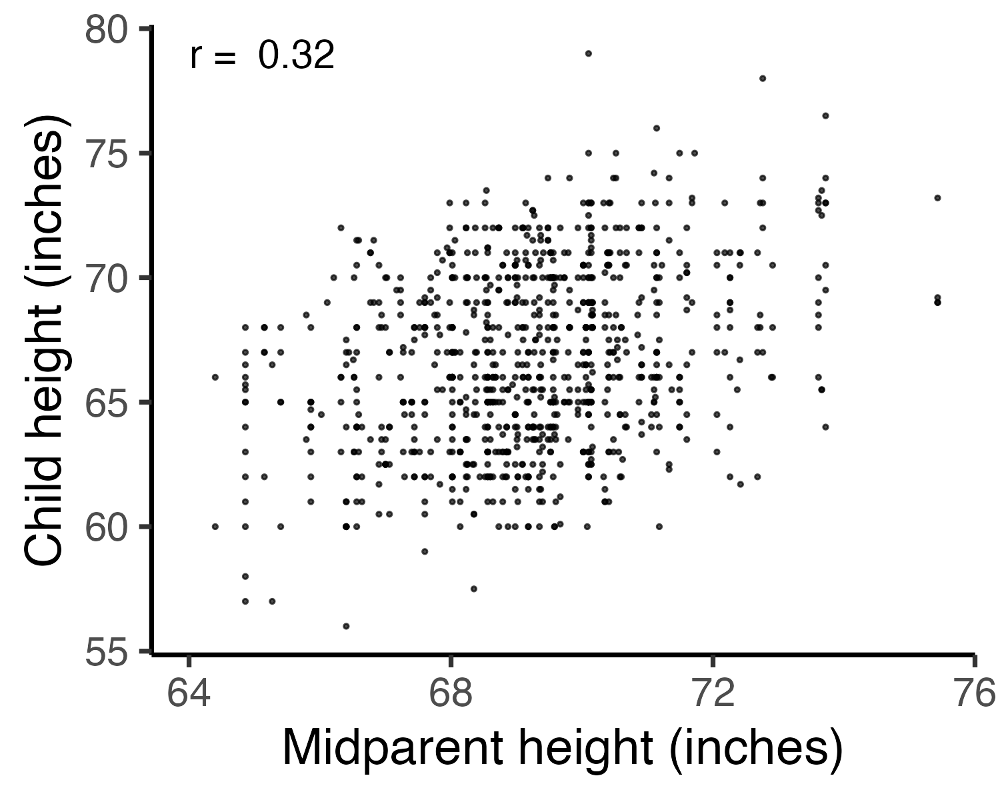
</center>

]]

---

class: center, middle

# How do you measure correlation?

<br>

# Pearson came up with this:

# $r = \frac{\text{Cov}(x, y)}{\text{sd}(x) * \text{sd}(y)}$

---

# How do you measure correlation?

.leftcol60[

## $r = \frac{\text{Cov}(x, y)}{\text{sd}(x) * \text{sd}(y)}$

.font130[

Assumptions:
1. Variables must be interval or ratio
2. Linear relationship

]]

--

.rightcol40[

<center>

</center>
<br>
<center>

</center>

]

---

# How do you _interpret_ $r$?

.leftcol[

## $r = \frac{\text{Cov}(x, y)}{\text{sd}(x) * \text{sd}(y)}$

Interpretation:
- $-1 \le r \le 1$
- Closer to 1 is stronger correlation
- Closer to 0 is weaker correlation

]

--

.rightcol[.code70[

```{r}
cor(x = GaltonFamilies$midparentHeight,
    y = GaltonFamilies$childHeight,
    method = 'pearson')
```

]

<center>

</center>

]

---

## What does $r$ mean?

.leftcol40[.font120[

- $\pm 0.1 - 0.3$: Weak
- $\pm 0.3 - 0.5$: Moderate
- $\pm 0.5 - 0.8$: Strong
- $\pm 0.8 - 1.0$: Very strong
]]

.rightcol60[

<center>

</center>

]

---

class: center,  middle

# Visualizing correlation is...um...easy, right?

<br>

# [guessthecorrelation.com](http://guessthecorrelation.com/)

# Click [here](https://docs.google.com/presentation/d/1-7VqNRJp53FawfNJwKLEkpoubGQ_x0wIkN2lAMP7Emw/edit?usp=sharing) to vote!

---

class: middle

.leftcol20[

## The datasaurus

### (More [here](https://www.autodeskresearch.com/publications/samestats))

]

.rightcol80[


]

---

# Coefficient of determination: $r^2$

.leftcol[.font130[

Percent of variance in one variable that is explained by the other variable

<center>
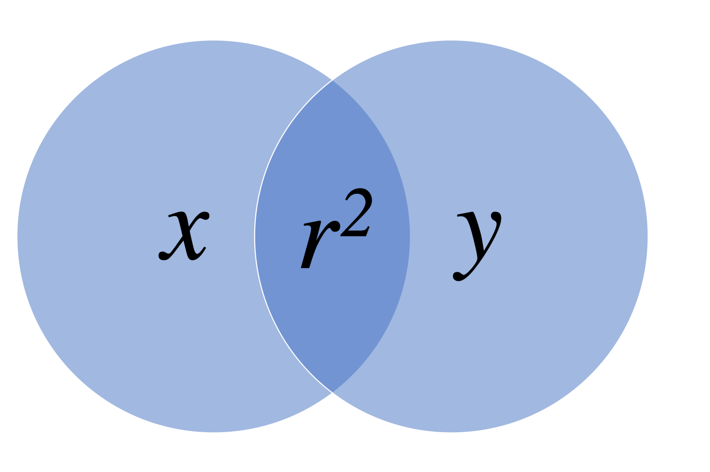
</center>

]]

--

.rightcol[

$r$ | $r^2$
----|------
0.1 | 0.01
0.2 | 0.04
0.3 | 0.09
0.4 | 0.16
0.5 | 0.25
0.6 | 0.36
0.7 | 0.49
0.8 | 0.64
0.9 | 0.81
1.0 | 1.00

]

---

## You should report both $r$ and $r^2$

<br>

### Correlation between parent and child height is 0.32, therefore 10% of the variance in the child height is explained by the parent height.

---

# Correlation != Causation

--

### X causes Y

- Training causes improved performance

--

### Y causes X

- Good (bad) performance causes people to train harder (less hard).

--

### Z causes both X & Y

- Commitment and motivation cause increased training and better performance.

---

class: center

## Be weary of dual axes!

## ([They can cause spurious correlations](https://www.tylervigen.com/spurious-correlations))

--

.leftcol[

.font120[Dual axes]

<center>

</center>

]

--

.rightcol[

.font120[Single axis]

<center>
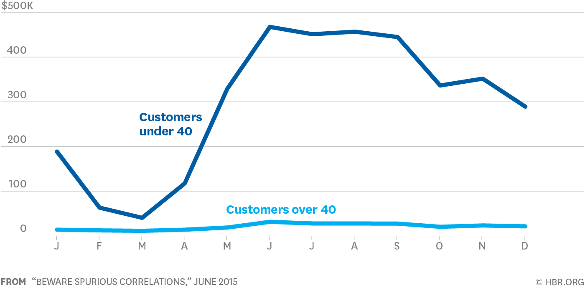
</center>

]

---

class: inverse, center

# Outliers

<center>

</center>

---

class: middle

<center>
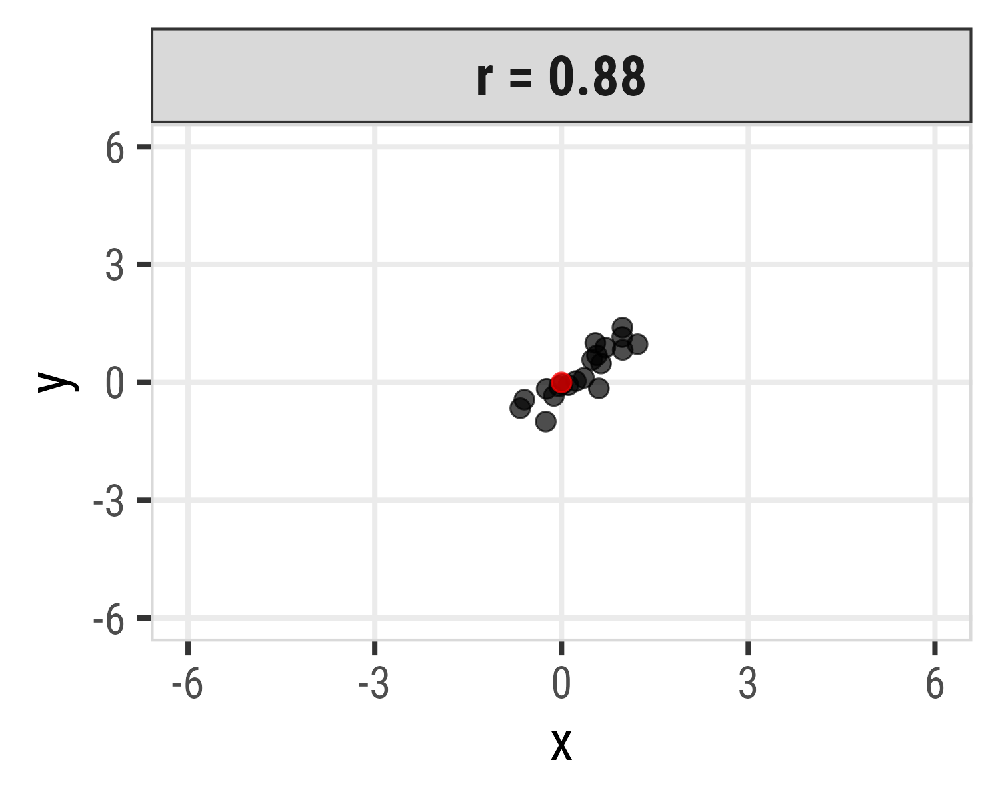
</center>

---

class: middle

<center>
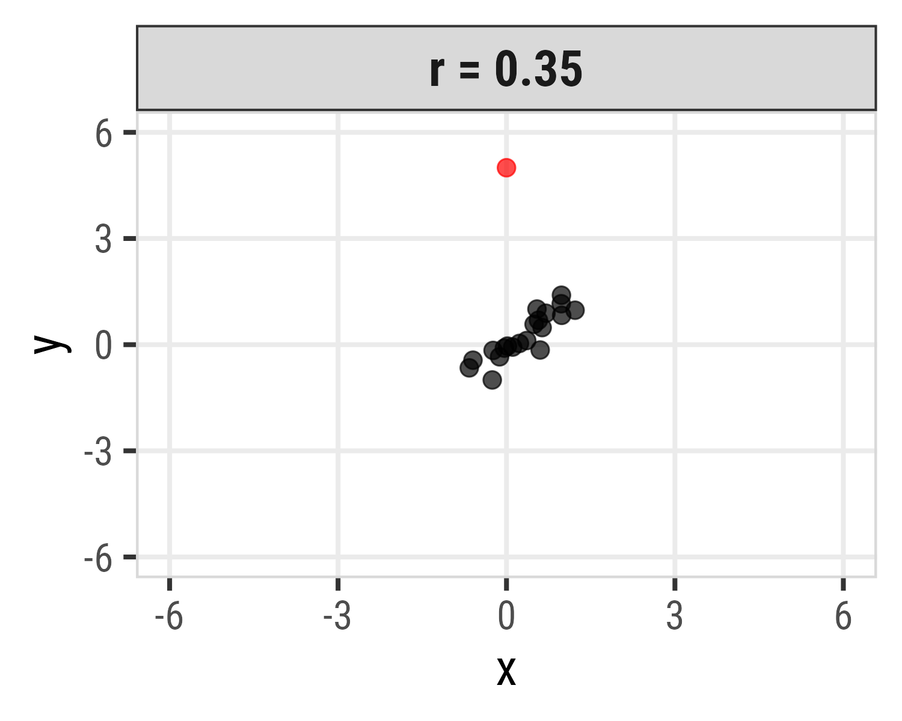
</center>

---

class: middle

<center>
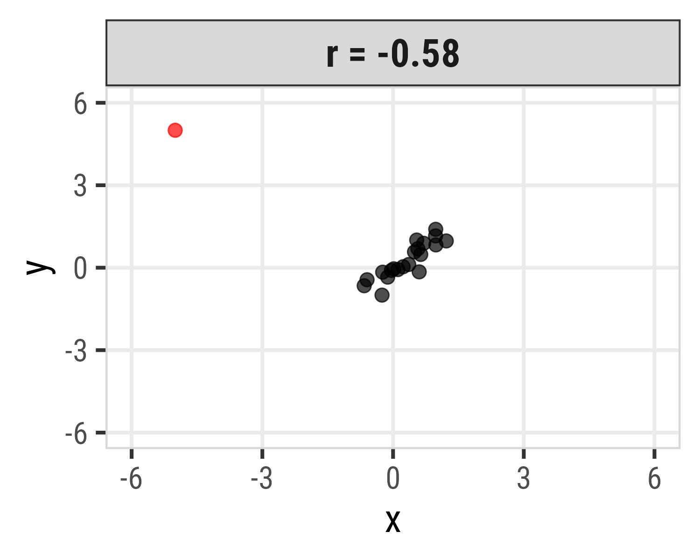
</center>

---

class: center, middle

## **Pearson** correlation is highly sensitive to outliers

<center>
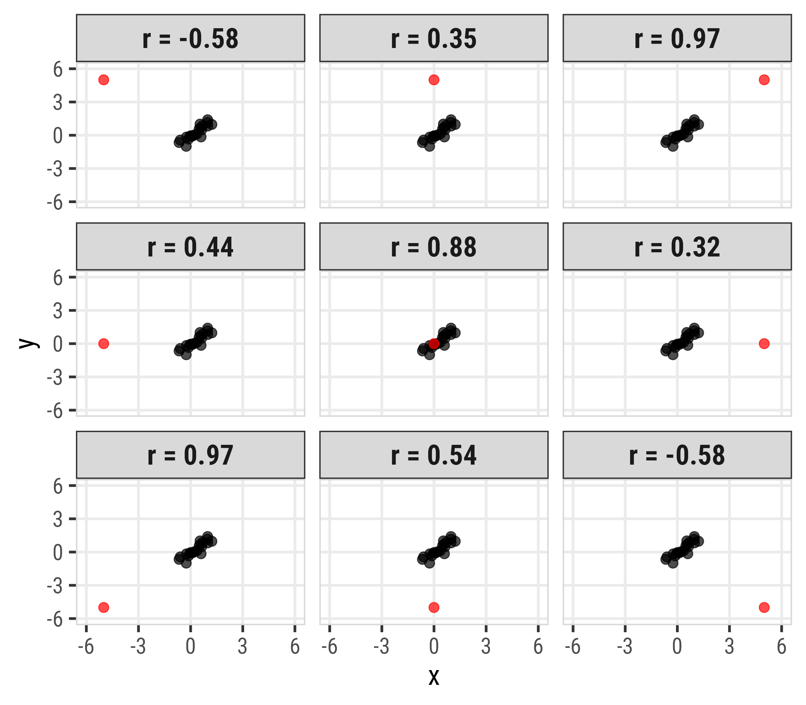
</center>

---

# **Spearman**'s rank-order correlation

# $r = \frac{\text{Cov}(x, y)}{\text{sd}(x) * \text{sd}(y)}$

--

.font120[

- Separately rank the values of X & Y.
- Use Pearson's correlation on the _ranks_ instead of the $x$ & $y$ values.

]

--

.font120[

Assumptions:

- Variables can be ordinal, interval or ratio
- Relationship must be monotonic (i.e. does not require linearity)

]

---

class: center, middle

## Spearman correlation more robust to outliers

<center>
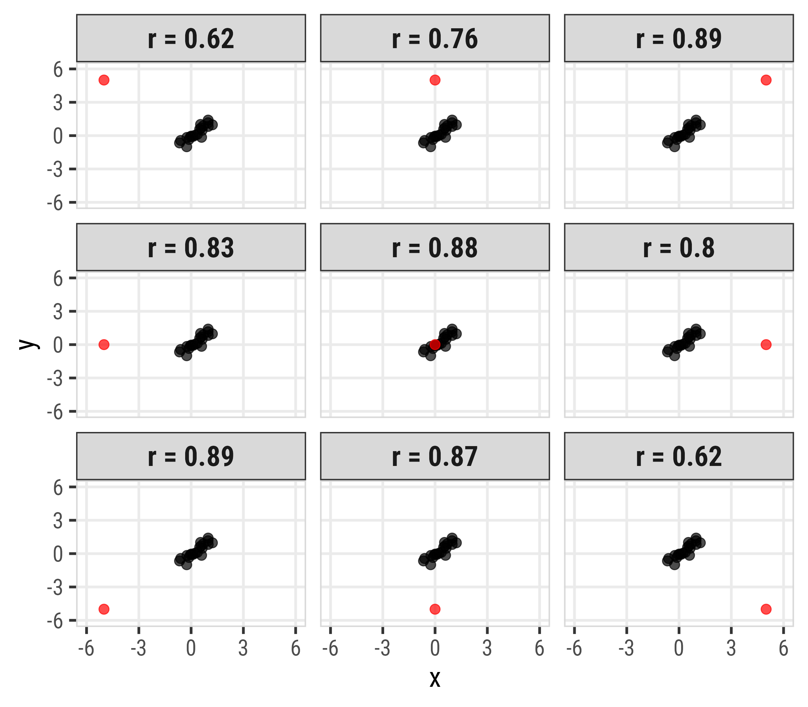
</center>

---

class: center, middle

## Spearman correlation more robust to outliers

.cols3[

<center>

</center>

]

.cols3[

```{r, echo=FALSE}
tribble(
    ~Pearson, ~Spearman,
    -0.56,    0.53,
    0.39,     0.69,
    0.94,     0.81,
    0.38,     0.76,
    0.81,     0.79,
    0.31,     0.70,
    0.95,     0.81,
    0.51,     0.75,
    -0.56,    0.53) %>%
    kable()
```

]

.cols3[

<center>
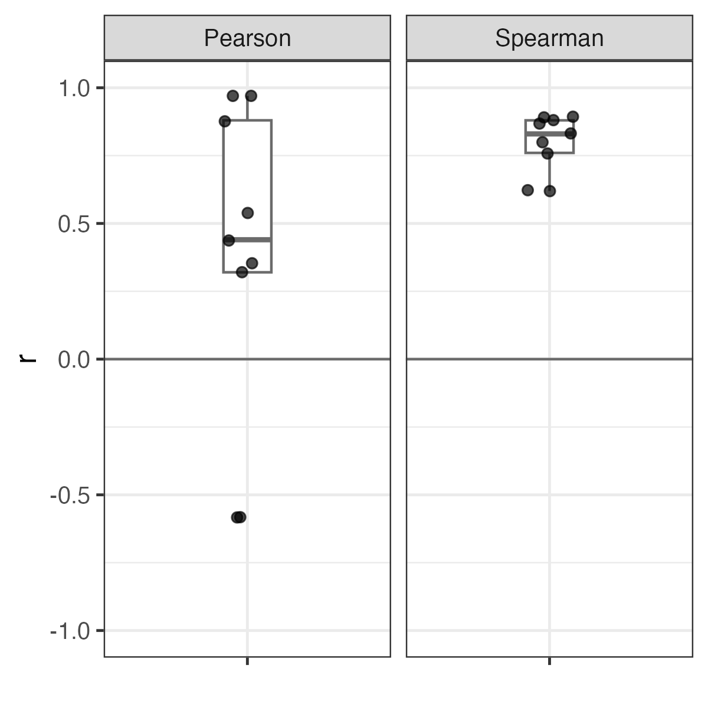
</center>

]

---

## Summary of correlation

.font120[

- **Pearson's correlation**: Described the strength of a **linear** relationship between two variables that are interval or ratio in nature.
- **Spearman's rank-order correlation**: Describes the strength of a **monotonic** relationship between two variables that are ordinal, interval, or ratio. **It is more robust to outliers**.
- The **coefficient of determination** ( $r^2$ ) describes the amount of variance in one variable that is explained by the other variable.
- **Correlation != Causation**

]

--

R command (hint: add `use = "complete.obs"` to drop NA values)

```{r, eval=FALSE}
pearson  <- cor(x, y, method = "pearson", use = "complete.obs")
spearman <- cor(x, y, method = "spearman", use = "complete.obs")
```

---

```{r child="topics/6.Rmd"}
```

---

## **Scatterplots**: The correlation workhorse

.leftcol[

```{r, eval=FALSE}
scatterplot <- mtcars %>% 
  ggplot() +
  geom_point( #<<
    aes(x = mpg, y = hp), #<<
    size = 2, alpha = 0.7 #<<
  ) + #<<
  theme_classic(base_size = 20) +
  labs(
    x = 'Fuel economy (mpg)',
    y = 'Engine power (hp)'
  )

scatterplot
```

]

.rightcol[

<center>
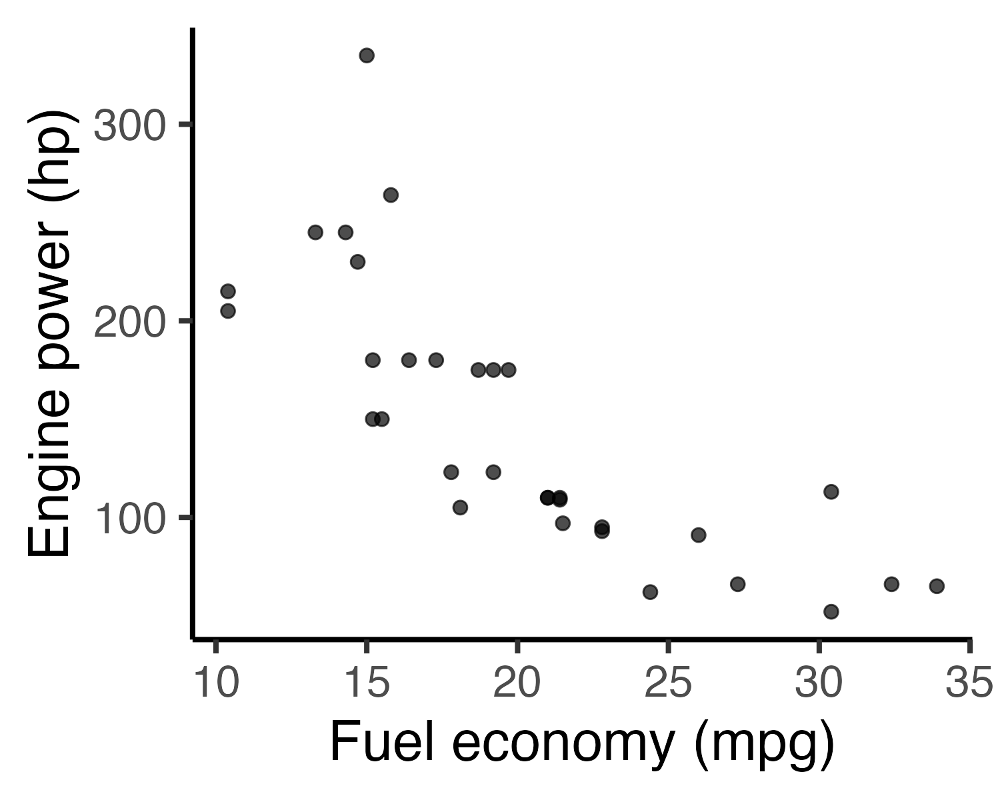
</center>

]

---

## Adding a correlation label to a chart

.leftcol[
Make the correlation label

```{r, eval=FALSE}
corr <- cor(
    mtcars$mpg, mtcars$hp,
    method = 'pearson')

corrLabel <- paste('r = ', round(corr, 2)) #<<
```

Add label to the chart with `annotate()`

```{r, eval=FALSE}
scatterplot +
  annotate( #<<
    geom = 'text', #<<
    x = 25, y = 310, #<<
    label = corrLabel, #<<
    hjust = 0, size = 7 #<<
  ) #<<
```
]

.rightcol[

<center>
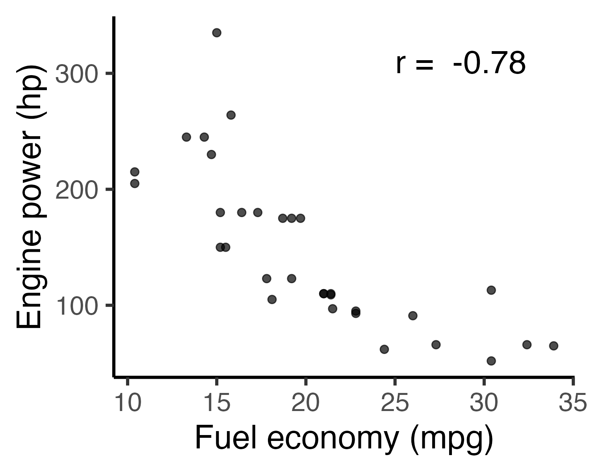
</center>

]

---

class: middle, center
background-color: #FFFFFF

<center>
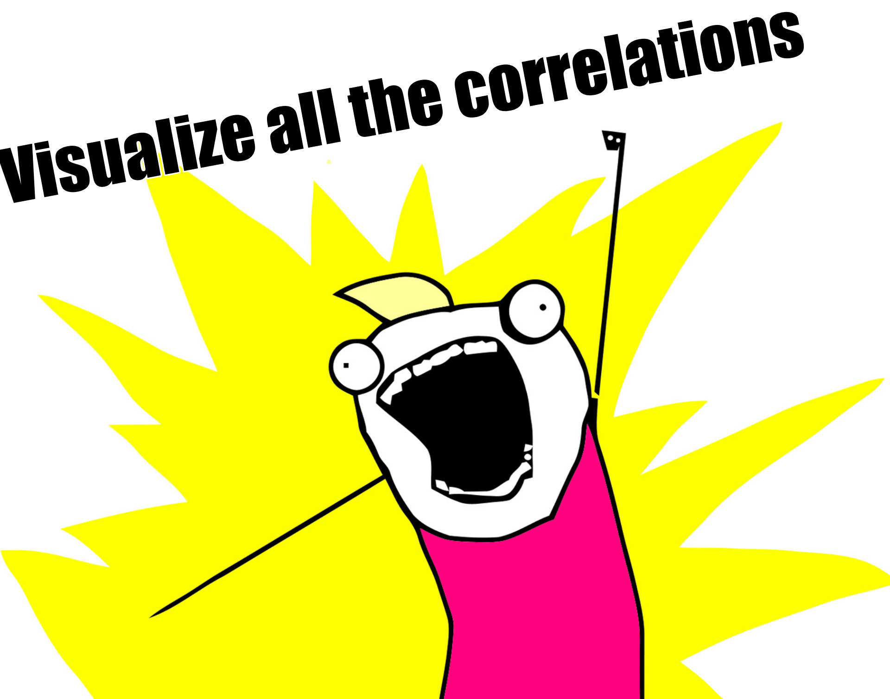
</center>

---

## Visualize all the correlations: `ggcorr()`

.leftcol[

```{r, eval=FALSE}
library('GGally')
```

```{r, eval=FALSE}
mtcars %>%
    ggcorr() #<<
```

]

.rightcol[

<center>
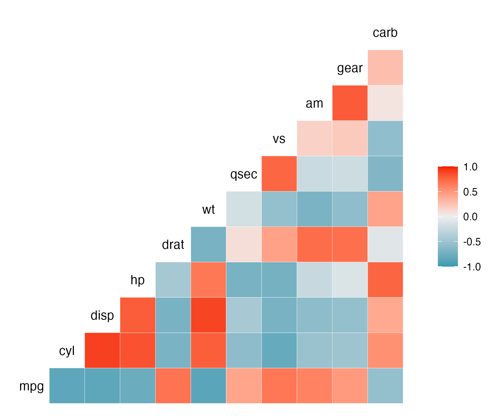
</center>

]

---

## Visualizing correlations: `ggcorr()`

.leftcol[

```{r, eval=FALSE}
library('GGally')
```

```{r, eval=FALSE}
mtcars %>%
    ggcorr(label = TRUE, #<<
           label_size = 3, #<<
           label_round = 2) #<<
```

]

.rightcol[

<center>
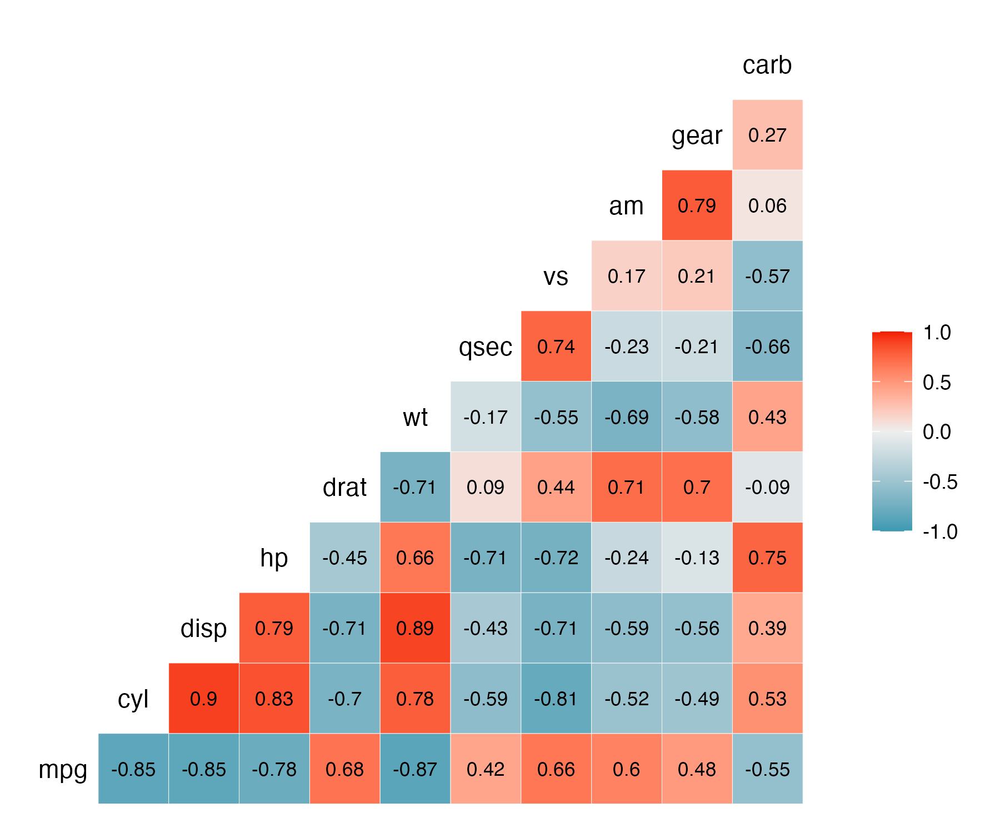
</center>

]

---

## Visualizing correlations: `ggcorr()`

.leftcol[

```{r, eval=FALSE}
ggcor_mtcars_final <- mtcars %>%
    ggcorr(label = TRUE,
           label_size = 3,
           label_round = 2,
           label_color = 'white', #<<
           nbreaks = 5,  #<<
           palette = "RdBu") #<<
```

]

.rightcol[

<center>
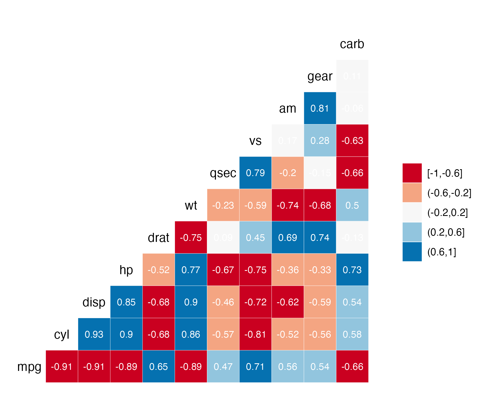
</center>

]

---

.leftcol[

## .center[Pearson]

```{r, eval=FALSE}
mtcars %>%
    ggcorr(label = TRUE,
           label_size = 3,
           label_round = 2,
           method = c("pairwise", "pearson")) #<<
```

<center>

</center>

]

.rightcol[

## .center[Spearman]

```{r, eval=FALSE}
mtcars %>%
    ggcorr(label = TRUE,
           label_size = 3,
           label_round = 2,
           method = c("pairwise", "spearman")) #<<
```

<center>
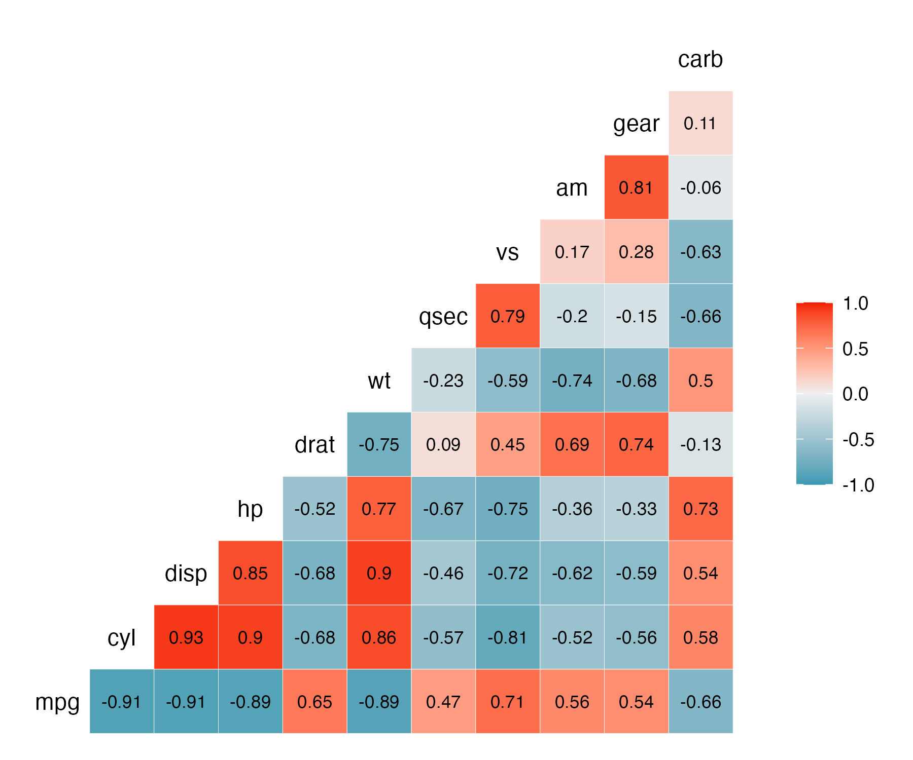
</center>

]

---

## Correlograms: `ggpairs()`

.leftcol40[

```{r, eval=FALSE}
library('GGally')
```
```{r, eval=FALSE}
mtcars %>%
    select(mpg, cyl, disp, hp, wt) %>%
    ggpairs() #<<
```

- Look for linear relationships
- View distribution of each variable

]

.rightcol60[

<center>
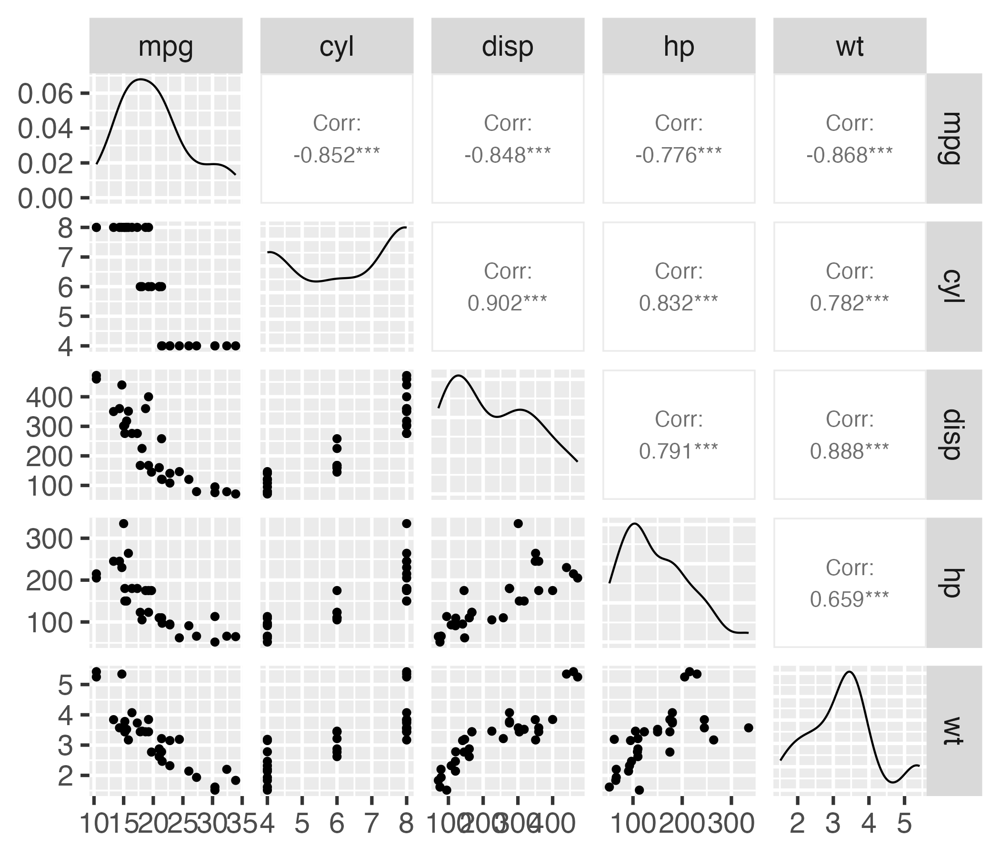
</center>

]

---

## Correlograms: `ggpairs()`

.leftcol40[

```{r, eval=FALSE}
library('GGally')
```
```{r, eval=FALSE}
mtcars %>%
    select(mpg, cyl, disp, hp, wt) %>%
    ggpairs() +
    theme_classic() #<<
```

- Look for linear relationships
- View distribution of each variable

]

.rightcol60[

<center>
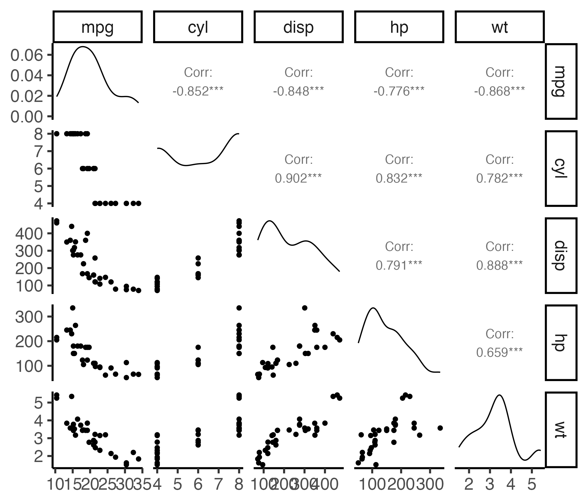
</center>

]

---

class: inverse

## Your turn

```{r, echo=FALSE}
countdown(
    minutes = 15,
    warn_when = 30,
    update_every = 15,
    top = 0,
    font_size = '2em'
)
```

.leftcol[

Using the `penguins` data frame:

1. Find the two variables with the largest correlation in absolute value (i.e. closest to -1 or 1).

2. Create a scatter plot of those two variables.

3. Add an annotation for the Pearson correlation coefficient.

]

.rightcol[

### .center[[palmerpenguins library](https://allisonhorst.github.io/palmerpenguins/)]

<center>

</center>

.right[Artwork by [@allison_horst](https://twitter.com/allison_horst)]

]

---

## **Simpson's Paradox**: when correlation betrays you

--

.leftcol[

.center[**Body mass vs. Bill depth**]

<center>
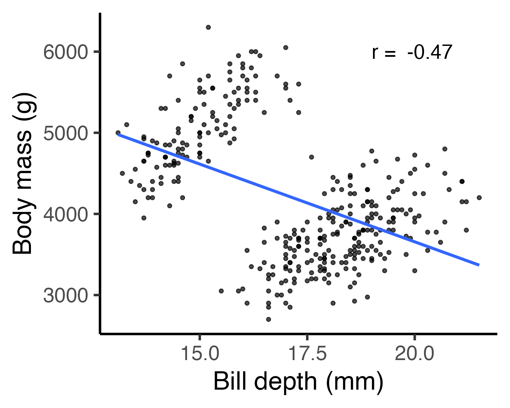
</center>

]

--

.rightcol[

.center[**Body mass vs. Bill depth**]

<center>
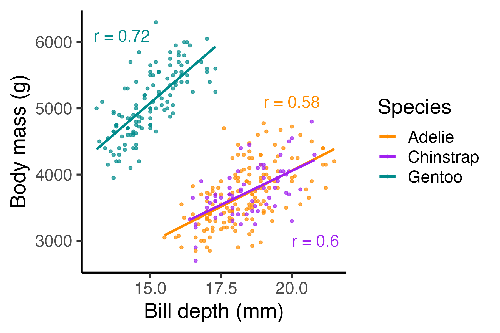
</center>

]

---

```{r child="topics/7.Rmd"}
```

---

## Visualizing variation

.leftcol30[

Ask yourself:

- What type of **variation** occurs within my variables?
- What type of **covariation** occurs between my variables?

Check out [these guides](https://eda.seas.gwu.edu/2023-Fall/references.html#choosing-the-right-chart)

]

.rightcol70[

<center>
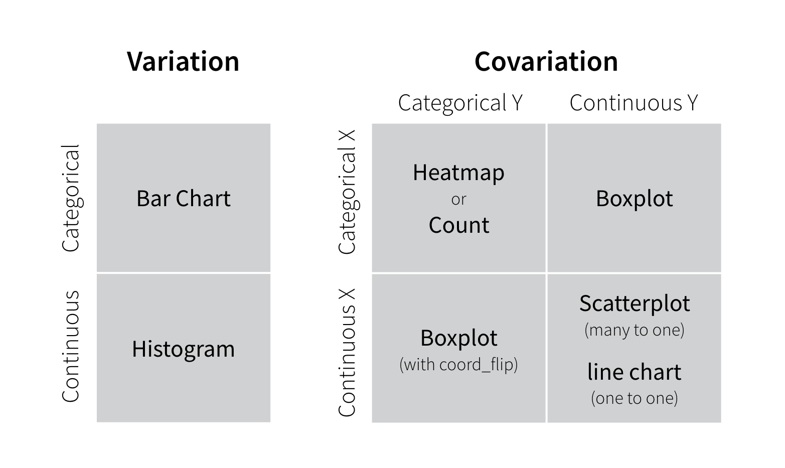
</center>

]

---

## Two **Categorical** Variables

Summarize with a table of counts

.leftcol60[

```{r}
wildlife_impacts %>%
    count(operator, time_of_day) #<<
```

]

---

## Two **Categorical** Variables

Convert to "wide" format with `pivot_wider()` to make it easier to compare values

.leftcol70[

```{r}
wildlife_impacts %>%
    count(operator, time_of_day) %>%
    pivot_wider(names_from = time_of_day, values_from = n) #<<
```

]

---

## Two **Categorical** Variables

.leftcol45[

Visualize with bars:<br>map **fill** to denote 2nd categorical var

```{r wildlife-two-var-bars, fig.width=9, fig.height=6, fig.align='center', fig.show='hide'}
wildlife_impacts %>%
  count(operator, time_of_day) %>%
  ggplot() +
  geom_col(
    aes(
      x = n,
      y = reorder(operator, n),
      fill = reorder(time_of_day, n) #<<
    ), 
    width = 0.7,
    position = 'dodge') + #<<
  theme(legend.position = "bottom") +
  labs(
    fill = "Time of day", 
    y = "Airline"
  )
```

]

.rightcol55[

```{r ref.label="wildlife-two-var-bars", fig.width=9, fig.height=6, fig.align='center', echo=FALSE}
```

]

---

## Two **Continuous** Variables

Visualize with scatterplot - looking for _clustering_ and/or _correlational_ relationship

.leftcol45[

```{r wildlife-scatterplot, fig.width=7, fig.height=4, fig.align='center', fig.show='hide'}
ggplot(wildlife_impacts) +
  geom_point(
    aes(
      x = speed, 
      y = height  
    ),
    size = 0.5) +
  labs(
    x = 'Speed (mph)',
    y = 'Height (f)'
  )
```

]

.rightcol55[

```{r ref.label="wildlife-scatterplot", fig.width=7, fig.height=4, fig.align='center', echo=FALSE}
```

]

---

## One **Continuous**, One **Categorical**

Visualize with **boxplot**

.leftcol45[

```{r wildlife-two-var-boxplot, fig.width=7, fig.height=4, fig.align='center', fig.show='hide'}
ggplot(wildlife_impacts) +
  geom_boxplot(
    aes(
      x = speed, 
      y = operator)
    ) + 
  labs(
    x = 'Speed (mph)',
    y = 'Airline'
  )
```

]

.rightcol55[

```{r ref.label="wildlife-two-var-boxplot", fig.width=7, fig.height=4, fig.align='center', echo=FALSE}
```

]

---

class: inverse

```{r, echo=FALSE}
countdown(
    minutes      = 15,
    warn_when    = 15,
    update_every = 1,
    top          = 0,
    right        = 0,
    font_size    = '2em'
)
```

# Practice doing EDA

1) Read in the `candy_rankings.csv` data sets

2) Preview the data, note the data types and what each variable is.

3) Visualize (at least) three _relationships_ between two variables (guided by a question) using an appropriate chart:

- Bar chart
- Scatterplot
- Boxplot

---

class: inverse, middle

# Reminders:

## You have **4** days until your [Project Proposal](https://eda.seas.gwu.edu/2024-Fall/project/1-proposal.html) is due

## You have **6** days until your [Mini Project 1](https://eda.seas.gwu.edu/2024-Fall/mini/1-data-cleaning.html) is due.

##  [Sign up](https://docs.google.com/spreadsheets/d/1qhV29wAumIuFv2Cwmy-sgEirfTi3_a8OCUsqFUWNkzw/edit?usp=sharing) for meeting slot next week

