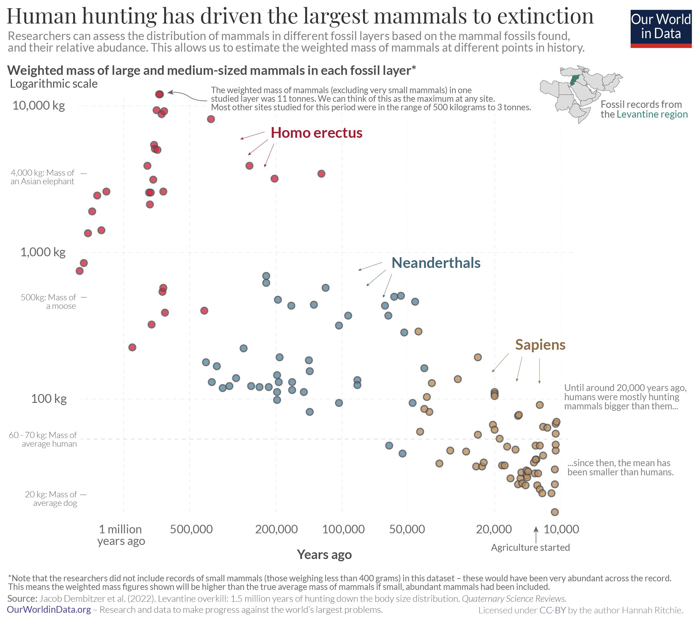

```{r setup, child="../setup.Rmd"}
```

---

# .center[Avoid causal language in Research Question]

.leftcol[

## .center[Causal]

> "How does weather affect / influence / impact metro ridership?

]

.rightcol[

## .center[Exploratory]

> "What factors are associated / correlated with changes in metro ridership?

]

---

# .center[Data are not "Valid" or "Invalid"]

--

- Don't say "we believe the data are valid because..."

--

- Instead, discuss possible sources of bias or other issues that could be present in the data.

--

.leftcol[

## .center[Poor assessment]

> "Our data is valid because it comes from a government source"

]

.rightcol[

## .center[Better assessment]

> "Although the data are from a government agency, we are skeptical that the data are unbiased or complete as the agency used self-reported numbers from a survey"

]

---

# .center[Look for inspiration in existing studies]

--

- It is okay to replicate **individual charts**.
- You still have to find the data and write the code.

--

.leftcol[

<center>

</center>

]

.rightcol[

https://ourworldindata.org/large-mammals-extinction

]

---

class: inverse

## Rest of today:

.leftcol60[

Individual meetings w/JP

- **Data Analysis Explorers**: Zeyu, Ji
- **Data WizRds**: Ayomide, Sahalae, Youssouf, Ben Yimaj
- **I.C.E.**: Marena, Federica, Sabina
- **NS**: Nishanth, Sai Kiran
- **Renewable Revolutionaries**: Pingfan, Abbey
- **Systems Sigmas**: Bogdan, Rayyan, Ian, Collin
- **Team A**: Abdullah, Jake, Arman, John
- **Team B**: Harshita & Dilrose
- **Team C**: Kejia & Jiaxin
- **Tidy DC**: Arsema, Kaitlyn, Amna, & Lola

]

.rightcol40[

While waiting, work w/.orange[Ben & Lydia] on:

- Revising your writing. 
- Looking for more data.
- Begin reading in / cleaning / exploring data.

]
